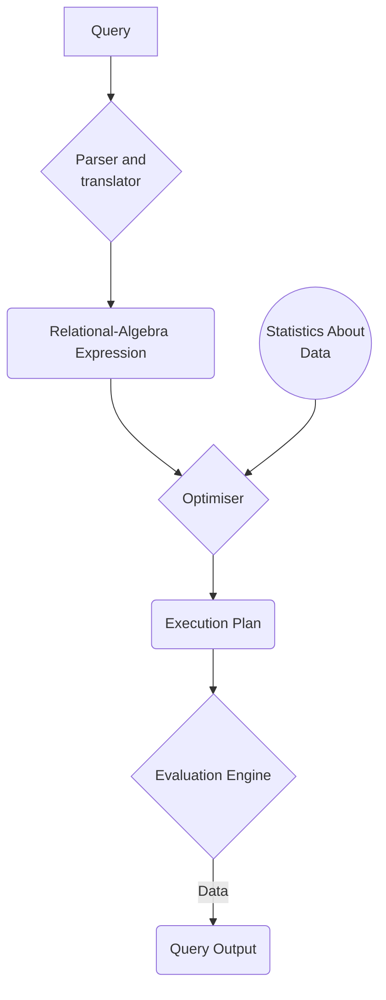

# Introduction to DBMS

## Levels of Abstraction

- **Physical Level**: Describes how a record is stored on the electronic disk.&#x20;
- **Logical Level:** Describes how data is stored in a database, and relations among the data fields. (`For Programmers and Database Engineers`)
- **View Level:** Application programs hide details of datatype and also some information for security systems.(`For end-user`)

//TODO: Image Fig(1.1) Page 34

## Schema And Instance

**Schema** is the way data will be organised and **Instance** is the actual data. We can consider **Schema** to be the `datatype` of variable and **Instance** to be the `value` of variable.

### Types of schema

- **Logical Schema:** The overall logical structure of the database.
- **Physical Schema:** The overall physical structure of the database.

### What is an "Instance"?

- The actual content of the database at an instant.&#x20;
- Similar to the `value` of the variable.

### Physical Data Independence

The ability to modify the physical schema without changing the logical schema is called Physical Data Independence.

- Similar to independence of **Interface** and **Implementation** in `Object-Oriented Systems`.
- Applications depend on the logical schema.
- Interfaces should be well defined so that changes in some parts do not seriously affect others.

## Data Models

A **Data Model** is a collection of tools to work and manipulate data, such as, data relationships, data semantics and data constraints.

There are various kinds of models:

- Relational Models (`Main focus for this course`)
- Entity-Relationship Data Models
- Network Models
- Object based Data Models

### Relational Model

- All data is stored in table.
- //TODO: Fig 1.2 p-2 Pg-40

## Data Definition Language (DDL)

- DDL is used for defining the database schema.&#x20;
- DDL compiler creates a set a of table templates and stores it under **Data Dictionary.**
- **Data Dictionary** contains metadata, i.e., data about data

## Data Manipulation Language (DML)

Used for accessing and manipulating data in the database. **DML** is also known as `Query Language`.

There are two types of DMLs:

### **Pure Languages**&#x20;

This languages are used for proving properties about computational power and for optimisation.

There are three sub sections for the pure languages:

- Relational Algebra
- Tuple Relational Calculus&#x20;
- Domain related Calculus

### **Commercial Languages**

Mainly used in commercial systems hence named `Commercial Languages`.&#x20;

- `SQL` is an example of widely used commercial language.&#x20;

## SQL&#x20;

The most widely used commercial DML.

- SQL is embedded to be used with another high-level language to solve complex problems

Applications created generally access database through some language extensions or some APIs.

## Database Design

There are two major types of design:

#### Logical Design

Talks about the logical layout of the database.

Depends on:

- **Business** **decision:** What attributes need to be recorded in the database.
- **Computer Science decision:** What relation schemas are required within the database.

#### Physical Design

Talks about the physical layout of the database.

## Design Approaches

The methodology used to ensure that each relationship in database is good.

This is achieved by two methods:

- Entity-Relationship Model
- Normalization Theory

## Relational Model

It only contains flat, **atomic** values, i.e., it cannot contain values as any composite data.

## Object-Relational Data Model

- It extends the **Relational Model** using object oriented paradigm with added datatypes
- Attributes can have composite data types
- Provide upward compatibility with existing relational languages

## Extensible Markup Language (XML)

- Originally a markup language developed by WWW Consortium
- It had the ability to specify new tags, and created nested **TAG** structure.&#x20;
- These features made it the basis for all new generation data interchange format

## Database Engine

It is basically composed of three main components:

- Storage Manager
- Query Processing
- Transaction Manager

### Storage Manager

It is a program module that provides the interface between the low level data stored in the database and the application programs and queries submitted to the system.&#x20;

The main functions of the **Storage Manager** are the:

- It interacts with the OS file manager.
- It efficiently stores, retrieves and updates data.

### Query Processing

### Transaction Manager
